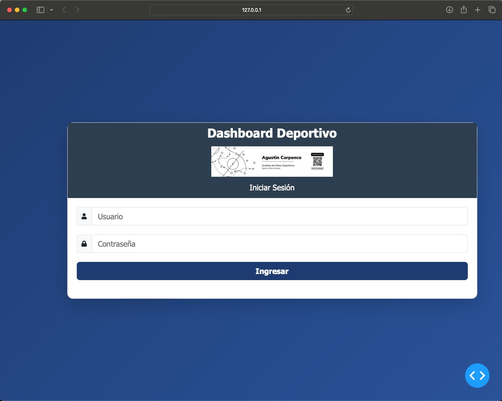
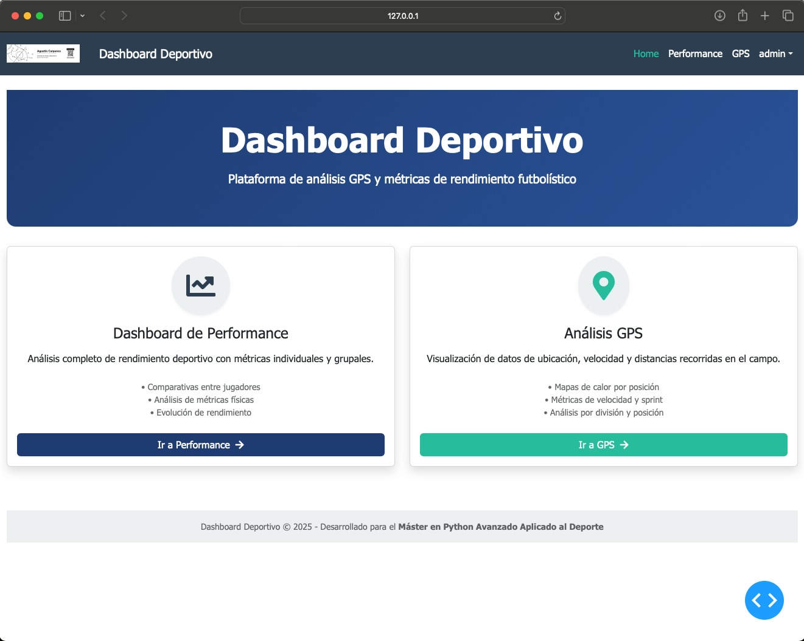
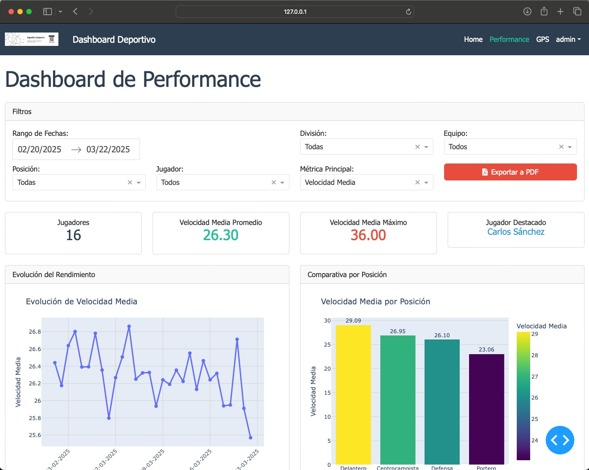
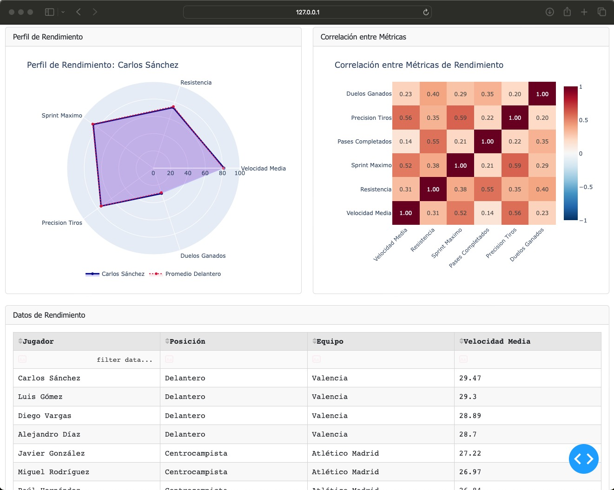
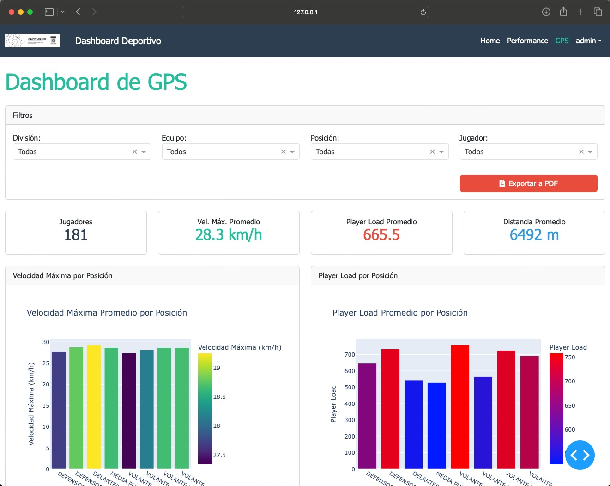
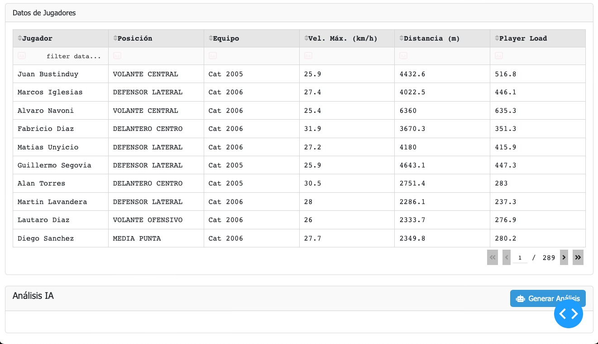

<!-- Página de Carátula -->

    

    <h1 style="font-size: 32px; margin-top: 50px; margin-bottom: 30px;">Dashboard Deportivo con Dash y Plotly</h1>

    <h2 style="font-size: 24px; margin-bottom: 30px;">Módulo 9 - Dash con Plotly, para crear aplicaciones de centralización de datos deportivos</h2>

    

        
<strong>Autor:</strong> Agustín Carpenco

        
<strong>Email:</strong> agustin.carpenco@gmail.com

        
<strong>Máster en Python Avanzado Aplicado al Deporte</strong>

    

    
    

        
    

# Documentación del Dashboard Deportivo

## Capturas de pantalla

### Página de Login

*Página de login con validación de usuario y contraseña. Acceso con usuario: admin, contraseña: admin.*

### Home

*Página principal con navegación a las diferentes secciones del dashboard.*

### Dashboard de Performance

*Dashboard de rendimiento deportivo con múltiples gráficos interactivos y sistema de filtrado.*

*Tabla de datos y sección de análisis IA en el dashboard de performance.*

### Dashboard de GPS

*Dashboard de análisis GPS con visualización de métricas de velocidad y distancia.*

*Tabla de datos detallados y análisis en el dashboard de GPS.*

## Funcionalidades implementadas

### Sistema de Autenticación
- Implementación de login con usuario y contraseña (admin/admin)
- Gestión de sesiones con Flask-Login
- Protección de rutas que requieren autenticación
- Logout funcional desde el menú desplegable

### Navegación y Layout
- Navbar responsivo con Dash Bootstrap Components
- Sistema de páginas con rutas configuradas
- Diseño consistente en todas las páginas
- Implementación de estilos personalizados

### Dashboard de Performance
- Filtros interactivos por división, equipo, posición y jugador
- Gráfico de evolución temporal de métricas seleccionadas
- Gráfico comparativo por posición
- Perfil de rendimiento en formato radar
- Mapa de calor de correlaciones entre métricas
- Tabla de datos con ordenamiento y filtrado
- Exportación a PDF con diseño personalizado
- Análisis IA mediante integración con Ollama

### Dashboard de GPS
- Filtros específicos para datos GPS
- Visualización de velocidad máxima por posición
- Análisis de Player Load
- KPIs destacados en tarjetas
- Tabla de datos detallados
- Exportación a PDF con análisis

### Interactividad y Datos
- Callbacks para actualización de filtros dependientes
- Manejo de errores y estados de carga
- Función para generar datos de ejemplo si no existen archivos
- Uso de dcc.Store para almacenar datos filtrados

## Desafíos encontrados y soluciones

### Desafío 1: Integración de Flask-Login con Dash
- **Problema**: Flask-Login requiere sesiones Flask mientras que Dash tiene su propio sistema de routing
- **Solución**: Implementación de callbacks para manejar el estado de login/logout y uso de dcc.Store para mantener el estado de sesión en el cliente

### Desafío 2: Filtros dependientes
- **Problema**: Los filtros debían actualizarse dependiendo de las selecciones previas
- **Solución**: Implementación de callbacks en cadena con prevención de llamadas iniciales

### Desafío 3: Exportación a PDF
- **Problema**: La generación de PDF completos con gráficos y análisis
- **Solución**: Uso de ReportLab para crear informes personalizados con datos filtrados

### Desafío 4: Integración con IA
- **Problema**: Conexión con servicio externo para análisis
- **Solución**: Implementación de una capa de abstracción en utils/ollama_integration.py y manejo de fallback con análisis automáticos

## Decisiones de diseño tomadas

### Arquitectura
- **Sistema de páginas**: Uso del sistema de páginas de Dash para mejor organización
- **Separación de responsabilidades**: Funciones específicas para cargar datos, filtrar y generar gráficos
- **Componentes reutilizables**: Funciones y layouts compartidos entre dashboards

### Interfaz de usuario
- **Tema Bootstrap**: Uso de FLATLY para un diseño moderno y profesional
- **Iconos FontAwesome**: Mejora de la experiencia visual
- **Tarjetas para KPIs**: Visualización rápida de métricas clave
- **Filtros colapsables**: Maximización del espacio disponible para visualizaciones

### Experiencia de usuario
- **Estados de carga**: Indicadores visuales durante procesamiento
- **Mensajes de error**: Información clara cuando no hay datos disponibles
- **Tooltips en gráficos**: Información detallada al interactuar con las visualizaciones
- **Filtros dependientes**: Actualización automática para evitar selecciones incompatibles

## Mejoras futuras

1. **Persistencia de datos**: Implementación de base de datos para almacenamiento persistente
2. **Módulo de administración**: Gestión de usuarios y permisos
3. **Personalización de dashboards**: Permitir a los usuarios guardar sus filtros preferidos
4. **Más visualizaciones**: Mapas de calor de posicionamiento en campo
5. **Comparativa entre periodos**: Análisis de evolución entre temporadas o periodos específicos

## Conclusión

El Dashboard Deportivo desarrollado cumple con todos los requisitos planteados en la tarea del Módulo 9 del Máster en Python Avanzado Aplicado al Deporte. Se ha implementado una aplicación completa con autenticación, múltiples dashboards, visualizaciones interactivas y capacidades avanzadas de análisis.

La arquitectura modular y el uso de buenas prácticas de programación permiten que este proyecto pueda expandirse y adaptarse a diferentes necesidades deportivas en el futuro.

## Autor

Agustín Carpenco - Máster en Python Avanzado Aplicado al Deporte